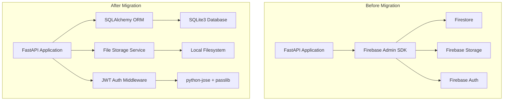
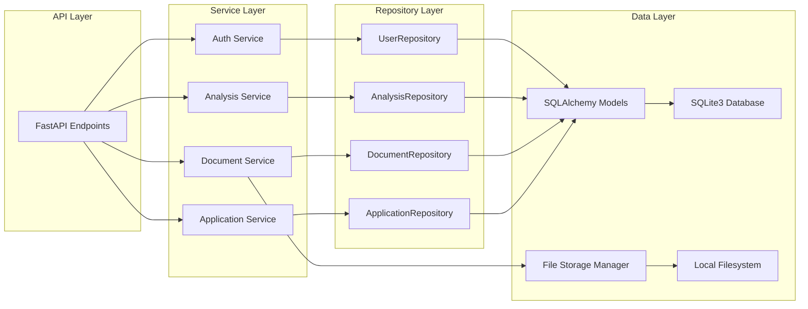

# Design Document: Firebase to SQLite3 Migration

## Overview

This design document outlines the technical approach for migrating the IntelliCredit AI-Powered Corporate Credit Decisioning Platform from Firebase (Firestore, Storage, Authentication) to SQLite3 with local file storage and JWT-based authentication. The migration maintains all existing API contracts while eliminating cloud dependencies.

The migration involves three major components:
1. **Database Layer**: Replace Firestore with SQLite3 using SQLAlchemy ORM
2. **Storage Layer**: Replace Firebase Storage with local filesystem storage
3. **Authentication Layer**: Replace Firebase Authentication with JWT-based authentication

## Architecture

### High-Level Architecture



### Component Architecture



## Components and Interfaces

### 1. Database Models (SQLAlchemy)

#### User Model
```python
class User(Base):
    __tablename__ = 'users'
    
    id: str = Column(String, primary_key=True)
    email: str = Column(String, unique=True, nullable=False, index=True)
    hashed_password: str = Column(String, nullable=False)
    full_name: str = Column(String)
    is_active: bool = Column(Boolean, default=True)
    created_at: datetime = Column(DateTime, default=datetime.utcnow)
    updated_at: datetime = Column(DateTime, default=datetime.utcnow, onupdate=datetime.utcnow)
    
    # Relationships
    applications = relationship("Application", back_populates="user")
    audit_logs = relationship("AuditLog", back_populates="user")
```

#### Application Model
```python
class Application(Base):
    __tablename__ = 'applications'
    
    id: str = Column(String, primary_key=True)
    user_id: str = Column(String, ForeignKey('users.id'), nullable=False, index=True)
    company_name: str = Column(String, nullable=False)
    status: str = Column(String, nullable=False, index=True)
    credit_amount: float = Column(Float)
    application_data: str = Column(Text)  # JSON string
    created_at: datetime = Column(DateTime, default=datetime.utcnow, index=True)
    updated_at: datetime = Column(DateTime, default=datetime.utcnow, onupdate=datetime.utcnow)
    
    # Relationships
    user = relationship("User", back_populates="applications")
    documents = relationship("Document", back_populates="application", cascade="all, delete-orphan")
    analyses = relationship("Analysis", back_populates="application", cascade="all, delete-orphan")
```

#### Document Model
```python
class Document(Base):
    __tablename__ = 'documents'
    
    id: str = Column(String, primary_key=True)
    application_id: str = Column(String, ForeignKey('applications.id'), nullable=False, index=True)
    filename: str = Column(String, nullable=False)
    file_path: str = Column(String, nullable=False)
    file_size: int = Column(Integer)
    content_type: str = Column(String)
    document_type: str = Column(String, index=True)
    uploaded_at: datetime = Column(DateTime, default=datetime.utcnow)
    
    # Relationships
    application = relationship("Application", back_populates="documents")
```

#### Analysis Model
```python
class Analysis(Base):
    __tablename__ = 'analyses'
    
    id: str = Column(String, primary_key=True)
    application_id: str = Column(String, ForeignKey('applications.id'), nullable=False, index=True)
    analysis_type: str = Column(String, nullable=False)
    analysis_results: str = Column(Text)  # JSON string
    confidence_score: float = Column(Float)
    status: str = Column(String, index=True)
    created_at: datetime = Column(DateTime, default=datetime.utcnow, index=True)
    
    # Relationships
    application = relationship("Application", back_populates="analyses")
```

#### AuditLog Model
```python
class AuditLog(Base):
    __tablename__ = 'audit_logs'
    
    id: int = Column(Integer, primary_key=True, autoincrement=True)
    user_id: str = Column(String, ForeignKey('users.id'), index=True)
    action: str = Column(String, nullable=False, index=True)
    resource_type: str = Column(String)
    resource_id: str = Column(String)
    details: str = Column(Text)  # JSON string
    timestamp: datetime = Column(DateTime, default=datetime.utcnow, index=True)
    
    # Relationships
    user = relationship("User", back_populates="audit_logs")
```

#### MonitoringData Model
```python
class MonitoringData(Base):
    __tablename__ = 'monitoring_data'
    
    id: int = Column(Integer, primary_key=True, autoincrement=True)
    metric_name: str = Column(String, nullable=False, index=True)
    metric_value: float = Column(Float, nullable=False)
    metric_unit: str = Column(String)
    tags: str = Column(Text)  # JSON string
    timestamp: datetime = Column(DateTime, default=datetime.utcnow, index=True)
```

### 2. Database Configuration

```python
class DatabaseConfig:
    """SQLite database configuration and session management"""
    
    def __init__(self, database_url: str):
        self.database_url = database_url
        self.engine = create_engine(
            database_url,
            connect_args={"check_same_thread": False},  # For SQLite
            pool_pre_ping=True
        )
        self.SessionLocal = sessionmaker(autocommit=False, autoflush=False, bind=self.engine)
    
    def create_tables(self):
        """Create all tables if they don't exist"""
        Base.metadata.create_all(bind=self.engine)
    
    def get_session(self) -> Session:
        """Get a database session"""
        return self.SessionLocal()
```

### 3. Repository Layer Refactoring

#### ApplicationRepository
```python
class ApplicationRepository:
    """Repository for application data access using SQLAlchemy"""
    
    def __init__(self, session: Session):
        self.session = session
    
    def create(self, application_data: dict) -> Application:
        """Create a new application"""
        application = Application(**application_data)
        self.session.add(application)
        self.session.commit()
        self.session.refresh(application)
        return application
    
    def get_by_id(self, application_id: str) -> Optional[Application]:
        """Get application by ID"""
        return self.session.query(Application).filter(Application.id == application_id).first()
    
    def get_by_user_id(self, user_id: str) -> List[Application]:
        """Get all applications for a user"""
        return self.session.query(Application).filter(Application.user_id == user_id).all()
    
    def update(self, application_id: str, update_data: dict) -> Optional[Application]:
        """Update an application"""
        application = self.get_by_id(application_id)
        if application:
            for key, value in update_data.items():
                setattr(application, key, value)
            self.session.commit()
            self.session.refresh(application)
        return application
    
    def delete(self, application_id: str) -> bool:
        """Delete an application"""
        application = self.get_by_id(application_id)
        if application:
            self.session.delete(application)
            self.session.commit()
            return True
        return False
    
    def list_with_filters(self, filters: dict, limit: int = 100, offset: int = 0) -> List[Application]:
        """List applications with filters"""
        query = self.session.query(Application)
        
        if 'status' in filters:
            query = query.filter(Application.status == filters['status'])
        if 'user_id' in filters:
            query = query.filter(Application.user_id == filters['user_id'])
        
        return query.order_by(Application.created_at.desc()).limit(limit).offset(offset).all()
```

#### DocumentRepository
```python
class DocumentRepository:
    """Repository for document metadata access using SQLAlchemy"""
    
    def __init__(self, session: Session):
        self.session = session
    
    def create(self, document_data: dict) -> Document:
        """Create a new document record"""
        document = Document(**document_data)
        self.session.add(document)
        self.session.commit()
        self.session.refresh(document)
        return document
    
    def get_by_id(self, document_id: str) -> Optional[Document]:
        """Get document by ID"""
        return self.session.query(Document).filter(Document.id == document_id).first()
    
    def get_by_application_id(self, application_id: str) -> List[Document]:
        """Get all documents for an application"""
        return self.session.query(Document).filter(Document.application_id == application_id).all()
    
    def delete(self, document_id: str) -> bool:
        """Delete a document record"""
        document = self.get_by_id(document_id)
        if document:
            self.session.delete(document)
            self.session.commit()
            return True
        return False
```

#### AnalysisRepository
```python
class AnalysisRepository:
    """Repository for analysis data access using SQLAlchemy"""
    
    def __init__(self, session: Session):
        self.session = session
    
    def create(self, analysis_data: dict) -> Analysis:
        """Create a new analysis"""
        analysis = Analysis(**analysis_data)
        self.session.add(analysis)
        self.session.commit()
        self.session.refresh(analysis)
        return analysis
    
    def get_by_id(self, analysis_id: str) -> Optional[Analysis]:
        """Get analysis by ID"""
        return self.session.query(Analysis).filter(Analysis.id == analysis_id).first()
    
    def get_by_application_id(self, application_id: str) -> List[Analysis]:
        """Get all analyses for an application"""
        return self.session.query(Analysis).filter(Analysis.application_id == application_id).all()
    
    def update(self, analysis_id: str, update_data: dict) -> Optional[Analysis]:
        """Update an analysis"""
        analysis = self.get_by_id(analysis_id)
        if analysis:
            for key, value in update_data.items():
                setattr(analysis, key, value)
            self.session.commit()
            self.session.refresh(analysis)
        return analysis
```

#### UserRepository
```python
class UserRepository:
    """Repository for user data access using SQLAlchemy"""
    
    def __init__(self, session: Session):
        self.session = session
    
    def create(self, user_data: dict) -> User:
        """Create a new user"""
        user = User(**user_data)
        self.session.add(user)
        self.session.commit()
        self.session.refresh(user)
        return user
    
    def get_by_id(self, user_id: str) -> Optional[User]:
        """Get user by ID"""
        return self.session.query(User).filter(User.id == user_id).first()
    
    def get_by_email(self, email: str) -> Optional[User]:
        """Get user by email"""
        return self.session.query(User).filter(User.email == email).first()
    
    def update(self, user_id: str, update_data: dict) -> Optional[User]:
        """Update a user"""
        user = self.get_by_id(user_id)
        if user:
            for key, value in update_data.items():
                setattr(user, key, value)
            self.session.commit()
            self.session.refresh(user)
        return user
```

### 4. File Storage Service

```python
class FileStorageService:
    """Service for managing local file storage"""
    
    def __init__(self, storage_root: str):
        self.storage_root = Path(storage_root)
        self.storage_root.mkdir(parents=True, exist_ok=True)
    
    def save_file(self, file_content: bytes, application_id: str, filename: str) -> str:
        """Save a file to local storage and return the file path"""
        # Create application-specific directory
        app_dir = self.storage_root / application_id
        app_dir.mkdir(parents=True, exist_ok=True)
        
        # Generate unique filename if needed
        file_path = app_dir / self._sanitize_filename(filename)
        counter = 1
        while file_path.exists():
            name, ext = os.path.splitext(filename)
            file_path = app_dir / f"{name}_{counter}{ext}"
            counter += 1
        
        # Write file
        with open(file_path, 'wb') as f:
            f.write(file_content)
        
        # Return relative path from storage root
        return str(file_path.relative_to(self.storage_root))
    
    def read_file(self, file_path: str) -> bytes:
        """Read a file from local storage"""
        full_path = self.storage_root / file_path
        if not self._is_safe_path(full_path):
            raise ValueError("Invalid file path")
        
        with open(full_path, 'rb') as f:
            return f.read()
    
    def delete_file(self, file_path: str) -> bool:
        """Delete a file from local storage"""
        full_path = self.storage_root / file_path
        if not self._is_safe_path(full_path):
            raise ValueError("Invalid file path")
        
        if full_path.exists():
            full_path.unlink()
            return True
        return False
    
    def _sanitize_filename(self, filename: str) -> str:
        """Sanitize filename to prevent directory traversal"""
        return os.path.basename(filename)
    
    def _is_safe_path(self, path: Path) -> bool:
        """Check if path is within storage root (prevent directory traversal)"""
        try:
            path.resolve().relative_to(self.storage_root.resolve())
            return True
        except ValueError:
            return False
```

### 5. JWT Authentication Service

```python
class AuthService:
    """Service for JWT-based authentication"""
    
    def __init__(self, secret_key: str, algorithm: str = "HS256", access_token_expire_minutes: int = 30):
        self.secret_key = secret_key
        self.algorithm = algorithm
        self.access_token_expire_minutes = access_token_expire_minutes
        self.pwd_context = CryptContext(schemes=["bcrypt"], deprecated="auto")
    
    def hash_password(self, password: str) -> str:
        """Hash a password using bcrypt"""
        return self.pwd_context.hash(password)
    
    def verify_password(self, plain_password: str, hashed_password: str) -> bool:
        """Verify a password against its hash"""
        return self.pwd_context.verify(plain_password, hashed_password)
    
    def create_access_token(self, data: dict, expires_delta: Optional[timedelta] = None) -> str:
        """Create a JWT access token"""
        to_encode = data.copy()
        
        if expires_delta:
            expire = datetime.utcnow() + expires_delta
        else:
            expire = datetime.utcnow() + timedelta(minutes=self.access_token_expire_minutes)
        
        to_encode.update({"exp": expire})
        encoded_jwt = jwt.encode(to_encode, self.secret_key, algorithm=self.algorithm)
        return encoded_jwt
    
    def decode_access_token(self, token: str) -> dict:
        """Decode and validate a JWT access token"""
        try:
            payload = jwt.decode(token, self.secret_key, algorithms=[self.algorithm])
            return payload
        except JWTError:
            raise ValueError("Invalid token")
    
    def authenticate_user(self, user_repo: UserRepository, email: str, password: str) -> Optional[User]:
        """Authenticate a user with email and password"""
        user = user_repo.get_by_email(email)
        if not user:
            return None
        if not self.verify_password(password, user.hashed_password):
            return None
        return user
```

### 6. Authentication Middleware

```python
async def get_current_user(
    token: str = Depends(oauth2_scheme),
    session: Session = Depends(get_db_session),
    auth_service: AuthService = Depends(get_auth_service)
) -> User:
    """FastAPI dependency to get current authenticated user"""
    credentials_exception = HTTPException(
        status_code=status.HTTP_401_UNAUTHORIZED,
        detail="Could not validate credentials",
        headers={"WWW-Authenticate": "Bearer"},
    )
    
    try:
        payload = auth_service.decode_access_token(token)
        user_id: str = payload.get("sub")
        if user_id is None:
            raise credentials_exception
    except ValueError:
        raise credentials_exception
    
    user_repo = UserRepository(session)
    user = user_repo.get_by_id(user_id)
    if user is None:
        raise credentials_exception
    
    return user
```

## Data Models

### Database Schema

```sql
-- Users table
CREATE TABLE users (
    id TEXT PRIMARY KEY,
    email TEXT UNIQUE NOT NULL,
    hashed_password TEXT NOT NULL,
    full_name TEXT,
    is_active BOOLEAN DEFAULT 1,
    created_at TIMESTAMP DEFAULT CURRENT_TIMESTAMP,
    updated_at TIMESTAMP DEFAULT CURRENT_TIMESTAMP
);

CREATE INDEX idx_users_email ON users(email);

-- Applications table
CREATE TABLE applications (
    id TEXT PRIMARY KEY,
    user_id TEXT NOT NULL,
    company_name TEXT NOT NULL,
    status TEXT NOT NULL,
    credit_amount REAL,
    application_data TEXT,
    created_at TIMESTAMP DEFAULT CURRENT_TIMESTAMP,
    updated_at TIMESTAMP DEFAULT CURRENT_TIMESTAMP,
    FOREIGN KEY (user_id) REFERENCES users(id) ON DELETE CASCADE
);

CREATE INDEX idx_applications_user_id ON applications(user_id);
CREATE INDEX idx_applications_status ON applications(status);
CREATE INDEX idx_applications_created_at ON applications(created_at);

-- Documents table
CREATE TABLE documents (
    id TEXT PRIMARY KEY,
    application_id TEXT NOT NULL,
    filename TEXT NOT NULL,
    file_path TEXT NOT NULL,
    file_size INTEGER,
    content_type TEXT,
    document_type TEXT,
    uploaded_at TIMESTAMP DEFAULT CURRENT_TIMESTAMP,
    FOREIGN KEY (application_id) REFERENCES applications(id) ON DELETE CASCADE
);

CREATE INDEX idx_documents_application_id ON documents(application_id);
CREATE INDEX idx_documents_document_type ON documents(document_type);

-- Analyses table
CREATE TABLE analyses (
    id TEXT PRIMARY KEY,
    application_id TEXT NOT NULL,
    analysis_type TEXT NOT NULL,
    analysis_results TEXT,
    confidence_score REAL,
    status TEXT,
    created_at TIMESTAMP DEFAULT CURRENT_TIMESTAMP,
    FOREIGN KEY (application_id) REFERENCES applications(id) ON DELETE CASCADE
);

CREATE INDEX idx_analyses_application_id ON analyses(application_id);
CREATE INDEX idx_analyses_status ON analyses(status);
CREATE INDEX idx_analyses_created_at ON analyses(created_at);

-- Audit logs table
CREATE TABLE audit_logs (
    id INTEGER PRIMARY KEY AUTOINCREMENT,
    user_id TEXT,
    action TEXT NOT NULL,
    resource_type TEXT,
    resource_id TEXT,
    details TEXT,
    timestamp TIMESTAMP DEFAULT CURRENT_TIMESTAMP,
    FOREIGN KEY (user_id) REFERENCES users(id) ON DELETE SET NULL
);

CREATE INDEX idx_audit_logs_user_id ON audit_logs(user_id);
CREATE INDEX idx_audit_logs_action ON audit_logs(action);
CREATE INDEX idx_audit_logs_timestamp ON audit_logs(timestamp);

-- Monitoring data table
CREATE TABLE monitoring_data (
    id INTEGER PRIMARY KEY AUTOINCREMENT,
    metric_name TEXT NOT NULL,
    metric_value REAL NOT NULL,
    metric_unit TEXT,
    tags TEXT,
    timestamp TIMESTAMP DEFAULT CURRENT_TIMESTAMP
);

CREATE INDEX idx_monitoring_data_metric_name ON monitoring_data(metric_name);
CREATE INDEX idx_monitoring_data_timestamp ON monitoring_data(timestamp);
```

### Data Type Mappings

| Firestore Type | SQLite3 Type | Notes |
|----------------|--------------|-------|
| String | TEXT | Direct mapping |
| Number | REAL or INTEGER | Use INTEGER for whole numbers, REAL for decimals |
| Boolean | BOOLEAN (INTEGER) | SQLite stores as 0/1 |
| Timestamp | TIMESTAMP (TEXT) | ISO 8601 format or UNIX timestamp |
| Map/Object | TEXT | Store as JSON string |
| Array | TEXT | Store as JSON string |
| Reference | TEXT | Store as foreign key ID |


## Correctness Properties

A property is a characteristic or behavior that should hold true across all valid executions of a system—essentially, a formal statement about what the system should do. Properties serve as the bridge between human-readable specifications and machine-verifiable correctness guarantees.

### Property 1: Repository Operation Equivalence

*For any* repository operation (create, read, update, delete, query with filters), the result produced by the SQLite3-based repository should be functionally equivalent to what the Firestore-based repository would have produced for the same operation and data.

**Validates: Requirements 2.4, 2.7**

### Property 2: Document Storage Round-Trip

*For any* uploaded document, storing it to the local filesystem and then retrieving it using the stored path should return content identical to the original uploaded content.

**Validates: Requirements 3.2, 3.3**

### Property 3: Document Deletion Completeness

*For any* document that exists in the system, after deletion, both the database record and the physical file on the filesystem should no longer exist.

**Validates: Requirements 3.4**

### Property 4: Filename Uniqueness

*For any* set of files uploaded to the same application, all stored file paths should be unique, even if the original filenames are identical.

**Validates: Requirements 3.6**

### Property 5: Path Traversal Prevention

*For any* file path input containing directory traversal attempts (e.g., "../", absolute paths), the file storage service should reject the operation and raise a security error.

**Validates: Requirements 3.7**

### Property 6: Password Hashing Security

*For any* user password, the stored password in the database should be a bcrypt hash (not plaintext), and verifying the original password against the hash should succeed.

**Validates: Requirements 4.4**

### Property 7: Authentication Token Round-Trip

*For any* valid user credentials, generating a JWT token and then decoding it should reveal the correct user identity information in the token claims.

**Validates: Requirements 4.5, 4.7**

### Property 8: Protected Endpoint Authentication

*For any* API endpoint that requires authentication, requests without a valid JWT token should be rejected with a 401 Unauthorized status code.

**Validates: Requirements 4.6**

### Property 9: API Request Compatibility

*For any* valid API request that worked in the pre-migration Firebase system, the SQLite3-based system should accept the same request format and produce a functionally equivalent response.

**Validates: Requirements 5.2, 5.3, 5.4**

### Property 10: API Error Response Compatibility

*For any* error condition that occurred in the pre-migration system, the SQLite3-based system should return the same error response format and HTTP status code.

**Validates: Requirements 5.5**

### Property 11: Foreign Key Integrity

*For any* database operation that would violate foreign key constraints (e.g., creating a document with a non-existent application_id), the database should reject the operation and raise an integrity error.

**Validates: Requirements 7.7**

### Property 12: Data Migration Preservation

*For any* data record in Firestore, after running the migration script, an equivalent record with all fields preserved should exist in SQLite3.

**Validates: Requirements 9.3**

### Property 13: File Migration Completeness

*For any* file stored in Firebase Storage, after running the migration script, the file should exist in the local filesystem and be retrievable with identical content.

**Validates: Requirements 9.4**

## Error Handling

### Database Errors

1. **Connection Errors**: If the SQLite database file cannot be accessed, raise a clear error message and prevent application startup
2. **Constraint Violations**: Foreign key violations, unique constraint violations, and not-null violations should raise specific exceptions with descriptive messages
3. **Transaction Failures**: If a transaction fails, roll back all changes and raise an exception with details
4. **Query Errors**: Invalid queries or missing tables should raise exceptions with SQL error details

### File Storage Errors

1. **File Not Found**: If a requested file doesn't exist, raise a FileNotFoundError with the file path
2. **Permission Errors**: If the application lacks permissions to read/write files, raise a PermissionError
3. **Disk Space**: If disk space is insufficient for file uploads, raise an appropriate error
4. **Path Traversal**: If directory traversal is detected, raise a SecurityError and log the attempt

### Authentication Errors

1. **Invalid Credentials**: Return 401 Unauthorized with message "Invalid email or password"
2. **Expired Token**: Return 401 Unauthorized with message "Token has expired"
3. **Invalid Token**: Return 401 Unauthorized with message "Invalid authentication token"
4. **Missing Token**: Return 401 Unauthorized with message "Authentication required"
5. **Inactive User**: Return 403 Forbidden with message "User account is inactive"

### Migration Errors

1. **Firebase Connection Failure**: If unable to connect to Firebase, halt migration and report error
2. **Data Export Failure**: If data export fails, log the specific collection/document and continue with others
3. **Data Import Failure**: If data import fails, roll back the transaction and report which records failed
4. **File Download Failure**: If file download from Firebase Storage fails, log the file and continue with others

## Testing Strategy

### Dual Testing Approach

The migration will be validated using both unit tests and property-based tests:

- **Unit tests**: Verify specific examples, edge cases, and error conditions
- **Property tests**: Verify universal properties across all inputs

Both testing approaches are complementary and necessary for comprehensive coverage. Unit tests catch concrete bugs in specific scenarios, while property tests verify general correctness across a wide range of inputs.

### Property-Based Testing

We will use **Hypothesis** (Python's property-based testing library) to implement the correctness properties defined above. Each property test will:

- Run a minimum of 100 iterations with randomly generated inputs
- Be tagged with a comment referencing the design document property
- Tag format: `# Feature: firebase-to-sqlite-migration, Property N: [property text]`

Example property test structure:

```python
from hypothesis import given, strategies as st

@given(st.text(min_size=1), st.binary(min_size=1))
def test_document_storage_round_trip(filename, content):
    """
    Feature: firebase-to-sqlite-migration, Property 2: Document Storage Round-Trip
    For any uploaded document, storing and retrieving should return identical content
    """
    # Test implementation
    pass
```

### Unit Testing

Unit tests will focus on:

1. **Specific Examples**: Test concrete scenarios like creating a user, uploading a specific document type
2. **Edge Cases**: Test empty inputs, maximum sizes, special characters, boundary conditions
3. **Error Conditions**: Test invalid inputs, missing data, constraint violations
4. **Integration Points**: Test interactions between repositories, services, and API endpoints

### Test Database Configuration

- Use in-memory SQLite databases (`:memory:`) for fast test execution
- Create fresh database schema before each test
- Clean up all data after each test to ensure isolation
- Use fixtures to provide common test data

### Test Coverage Goals

- Maintain at least 80% code coverage across all modules
- 100% coverage for critical paths: authentication, data persistence, file storage
- All repository methods must have both unit tests and property tests
- All API endpoints must have integration tests

### Migration Testing

1. **Pre-Migration Snapshot**: Capture current Firebase data state
2. **Migration Execution**: Run migration scripts with test data
3. **Post-Migration Validation**: Verify all data and files migrated correctly
4. **Functional Testing**: Test all API endpoints with migrated data
5. **Rollback Testing**: Verify rollback procedures work correctly

## Implementation Notes

### Dependencies to Add

```
sqlalchemy>=2.0.0
python-jose[cryptography]>=3.3.0
passlib[bcrypt]>=1.7.4
hypothesis>=6.0.0  # For property-based testing
```

### Dependencies to Remove

```
firebase-admin
```

### Configuration Changes

**Before (Firebase):**
```python
FIREBASE_CREDENTIALS_PATH=path/to/serviceAccountKey.json
FIREBASE_STORAGE_BUCKET=your-project.appspot.com
```

**After (SQLite3):**
```python
DATABASE_URL=sqlite:///./intellicredit.db
FILE_STORAGE_ROOT=./storage
JWT_SECRET_KEY=your-secret-key-here
JWT_ALGORITHM=HS256
JWT_ACCESS_TOKEN_EXPIRE_MINUTES=30
```

### Migration Execution Plan

1. **Preparation Phase**:
   - Back up all Firebase data
   - Set up SQLite3 database and local storage directories
   - Configure new environment variables

2. **Migration Phase**:
   - Run data export script to extract all Firestore data
   - Run file download script to download all Firebase Storage files
   - Run data import script to populate SQLite3 database
   - Verify data integrity and completeness

3. **Validation Phase**:
   - Run full test suite against migrated data
   - Perform manual testing of critical workflows
   - Compare API responses between old and new systems

4. **Cutover Phase**:
   - Update application configuration to use SQLite3
   - Deploy updated application
   - Monitor for errors and performance issues
   - Keep Firebase as read-only backup for rollback if needed

### Performance Considerations

1. **Database Indexes**: Ensure all frequently queried columns have indexes
2. **Connection Pooling**: Use SQLAlchemy's connection pooling for better performance
3. **File I/O**: Consider caching frequently accessed files in memory
4. **Query Optimization**: Use SQLAlchemy's query optimization features and avoid N+1 queries
5. **Transaction Management**: Use transactions appropriately to balance consistency and performance

### Security Considerations

1. **JWT Secret**: Use a strong, randomly generated secret key (minimum 256 bits)
2. **Password Hashing**: Use bcrypt with appropriate work factor (12-14 rounds)
3. **File Storage**: Validate and sanitize all file paths to prevent directory traversal
4. **SQL Injection**: Use SQLAlchemy's parameterized queries (ORM handles this automatically)
5. **Database Permissions**: Ensure SQLite database file has appropriate file system permissions
6. **Token Expiration**: Set reasonable token expiration times and implement refresh tokens
